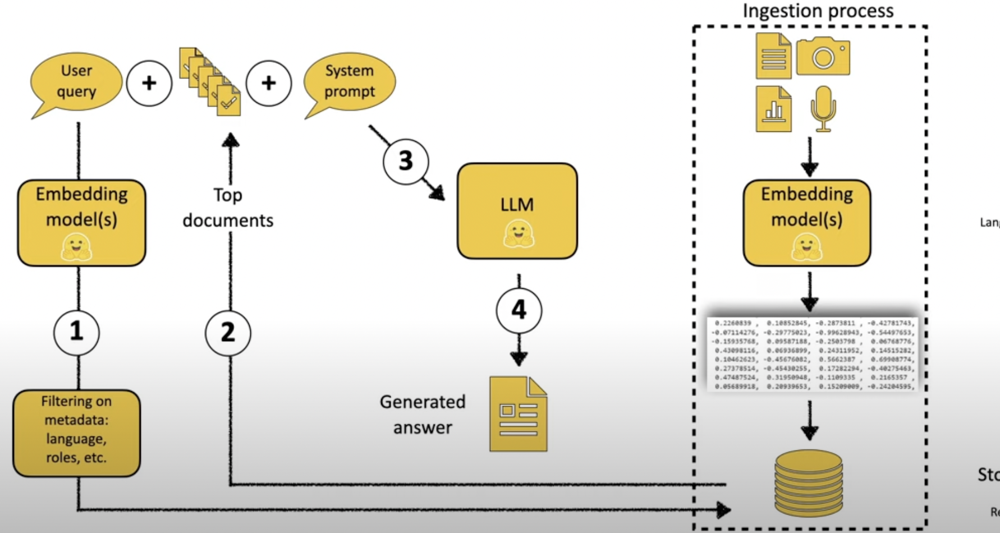

# dhansankalp
<<<<<<< HEAD

=======
Data-driven financial analysis workflows utilizing Large Language Model (LLM) NLP and ensemble spatial/sequential neural network architectures; extracted actionable revenue insights, cost drivers, and risk indicators enabling analytics-based decision making.
Architected cutting edge deep learning growth rate predictor combining convolutional neural networks, recurrent neural networks, and attention mechanisms to capture spatial interdependencies and temporal dynamics within financial data at scale.

>>>>>>> 5fa964ce46732272364f1144a65f566dc263d00c